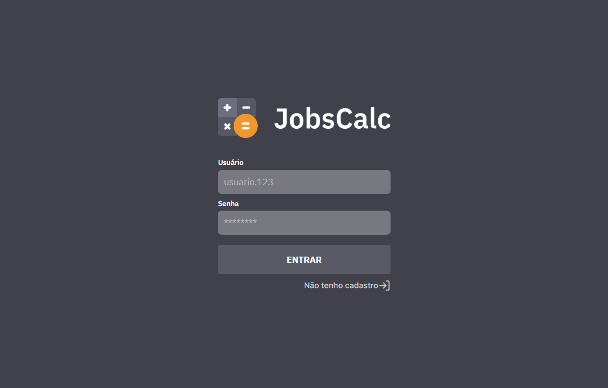
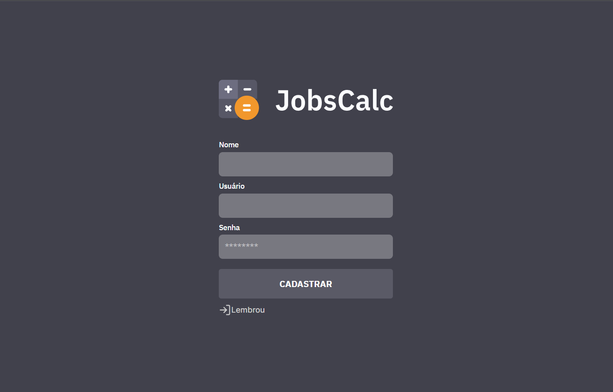
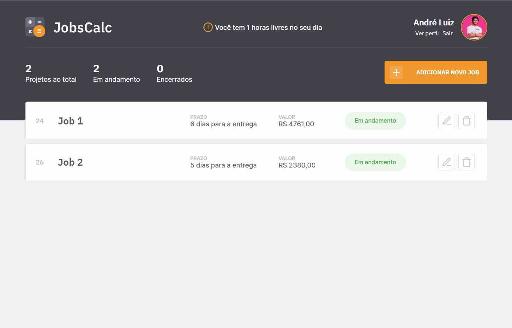
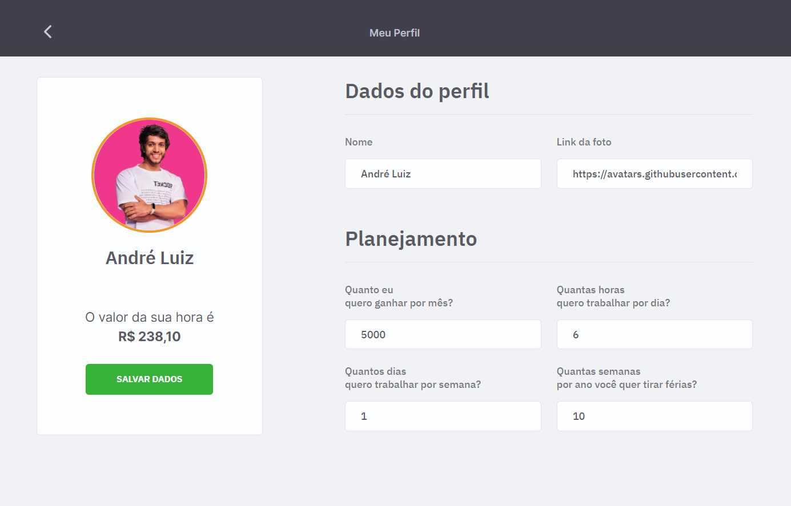
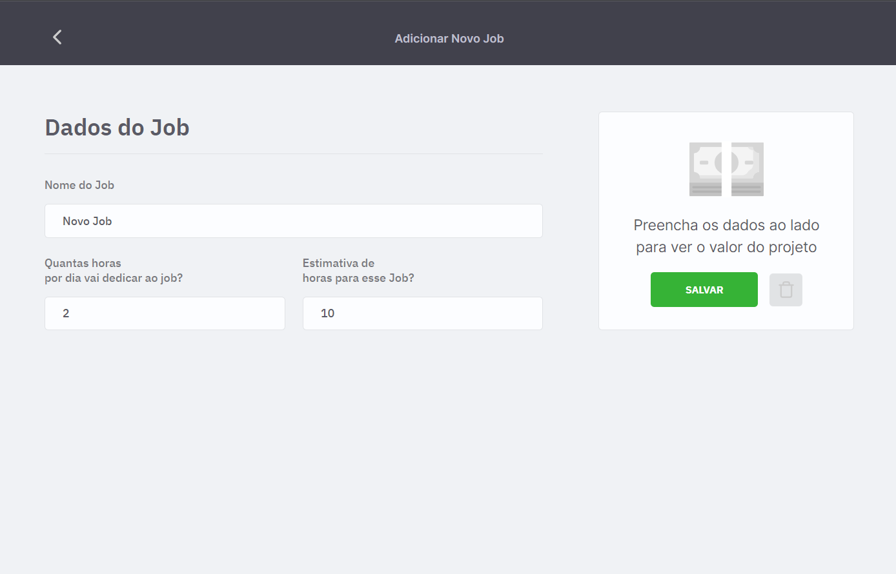
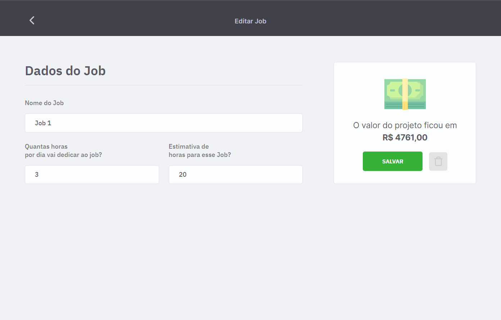
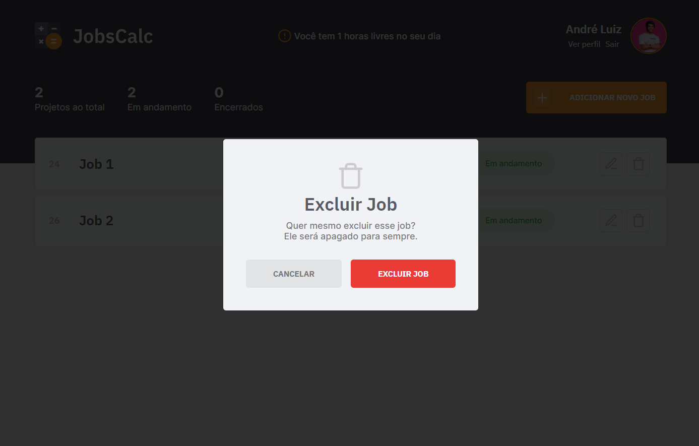
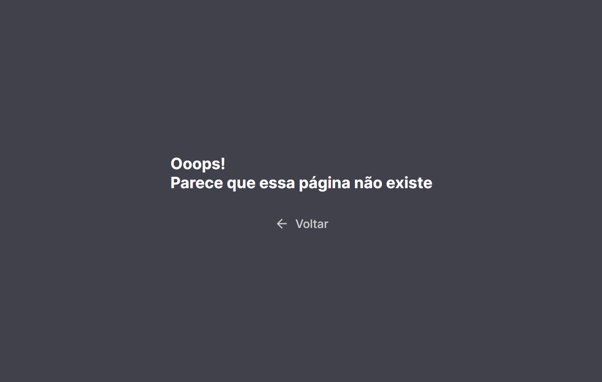

<h1 align="center">
    
</h1>

<h4 align="center">
  🚀 Maratona Discover 2
</h4>


<p align="center">
  <a href="#-tecnologias">Tecnologias</a>&nbsp;&nbsp;&nbsp;|&nbsp;&nbsp;&nbsp;
  <a href="#-projeto">Projeto</a>&nbsp;&nbsp;&nbsp;|&nbsp;&nbsp;&nbsp;
  <a href="#instalação">Instalação</a>&nbsp;&nbsp;&nbsp;|&nbsp;&nbsp;&nbsp;
  <a href="#telas">Telas</a>
</p>


## 🚀 Tecnologias

Esse projeto foi desenvolvido com as seguintes tecnologias:

- [Django](https://www.djangoproject.com/)
- [Django-Rest-Framework](https://www.django-rest-framework.org/)
- [React](https://reactjs.org)


## 💻 Projeto
**O JobsCalc é uma aplicação de estimativa de cálculo para projetos freelancer, onde é possível cadastrar e excluir jobs (projetos), obtendo uma estimativa de custo de cada job. Além disso, é possível traçar o valor da hora da pessoa que estará usando o sistema 💰**

## Instalação
### Pré requisitos
Ter instalado:
- [Python](https://www.python.org/downloads/)
- [Node](https://nodejs.org/en/download/)
- [Yarn](https://classic.yarnpkg.com/en/docs/install/)


## BACKEND
```sh
# Clonar repositório
git clone https://github.com/andre23arruda/jobs-calc.git

# Entrar na pasta dos arquivos do backend
cd backend

# Criar um ambiente virtual
python -m venv venv

# Ativar o ambiente virtual
. venv/Scripts/activate
# ou source ./venv/Scripts/activate

# Instalar os pacotes necessários
pip install -r requirements.txt

# Gerar variáveis de ambiente
python contrib/env_gen.py

# Executar as migrações
python manage.py migrate

# Run
. run.sh
```


### FRONTEND
```sh
# Abrir outro terminal
# Entrar na pasta dos arquivos do frontend
cd frontend

# Instalar os pacotes do projeto
yarn install

# Run
yarn start
```

## Telas
<div align="center">
    
</div>
<p align="center">Login</p>
<hr>

<div align="center">
    
</div>
<p align="center">Signup</p>
<hr>

<div align="center">
    
</div>
<p align="center">Jobs Dashboard</p>
<hr>

<div align="center">
    
</div>
<p align="center">Profile</p>
<hr>

<div align="center">
    
</div>
<p align="center">New Job</p>
<hr>

<div align="center">
    
</div>
<p align="center">Edit Job</p>
<hr>

<div align="center">
    
</div>
<p align="center">Delete Job</p>
<hr>

<div align="center">
    
</div>
<p align="center">Page 404</p>
